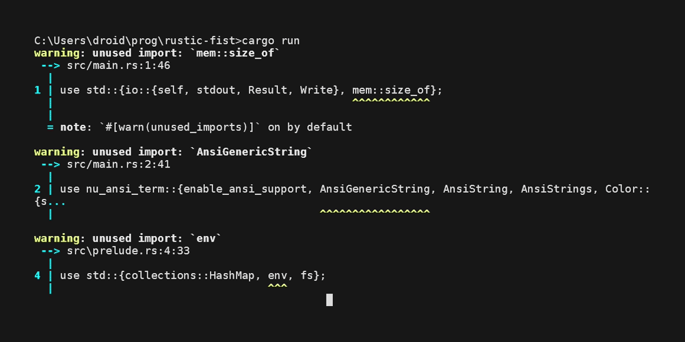
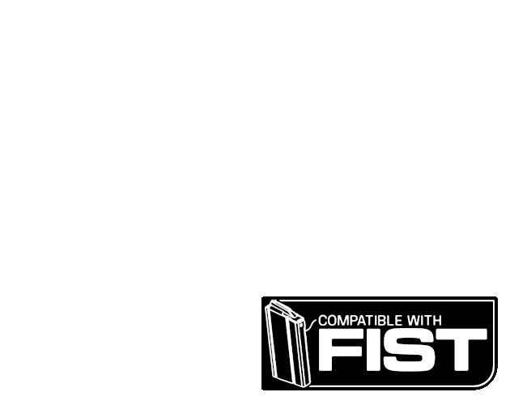

# Rustic FIST

This project, written in Rust, implements a command-line application to query and generate data for the [FIST: Ultimate RPG](https://claymorerpgs.itch.io/) by [Claymore Roleplaying Games](http://claymorerpgs.com/). It's just a *silly thing* for those who still like command-line terminals:

* access *FIST: Ultimate Supply Depot* tables like a filesystem
* search roles, traits, and anything else within the FIST: Ultimate rulebook.
* generate random roles, traits, and anything else within the FIST: Ultimate rulebook.
* ~~create, edit, remove roles, traits, tags, gear, and characters~~
* using FIST data, dynamically generate characters for the game
* a dicepool system and rolling algorithms
* want to test custom bonuses and easily make a hundred(s) rolls based on your custom dicepool and get various measurements of central tendencies incuding averages, spread, and standard deviation? It's here.

⚠️🚧 Some features are not yet implemented, or have been removed, and it is not completely tested. Expect crashes and issues. 

When the first binary release is made, it will also be available at [itch.io](https://nevdull.itch.io/)

This project is a bit of research-oriented development, and is not really optimized, or probably not even well-written, but it's *good enough for government work.* 

This project has served as a learning platform for a more advanced, feature-rich version releasing in support of the  drop of `FIST Factions`, an expansion for FIST: Ultimate that includes a [Fist Factions core rule PDF](https://nevdull.itch.io/), command-line application and three Faction-oriented setting supplements for the expansion set in the neon '80s. 

## Credits and Attributions
Some ideas and functionality shamelessly taken from [Rise RPG](https://github.com/Vadskye/Rise.git)

[FIST: Ultimate RPG](https://claymorerpgs.itch.io/) written by B. Everett Dutton.

Uses [FIST JSON Data](https://ululu.itch.io/fist-json-data) by [ululu](https://ululu.itch.io/)

## License
Software uses MIT LICENSE.

